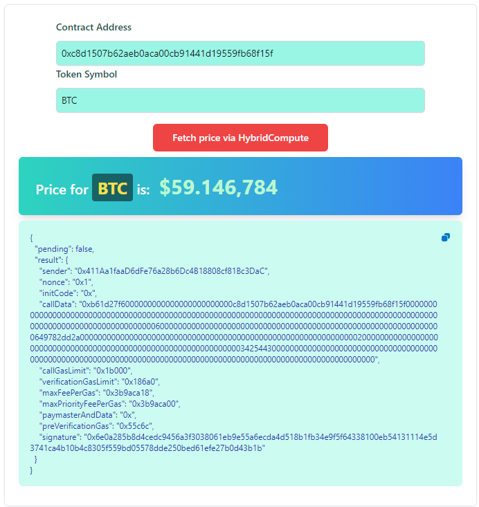
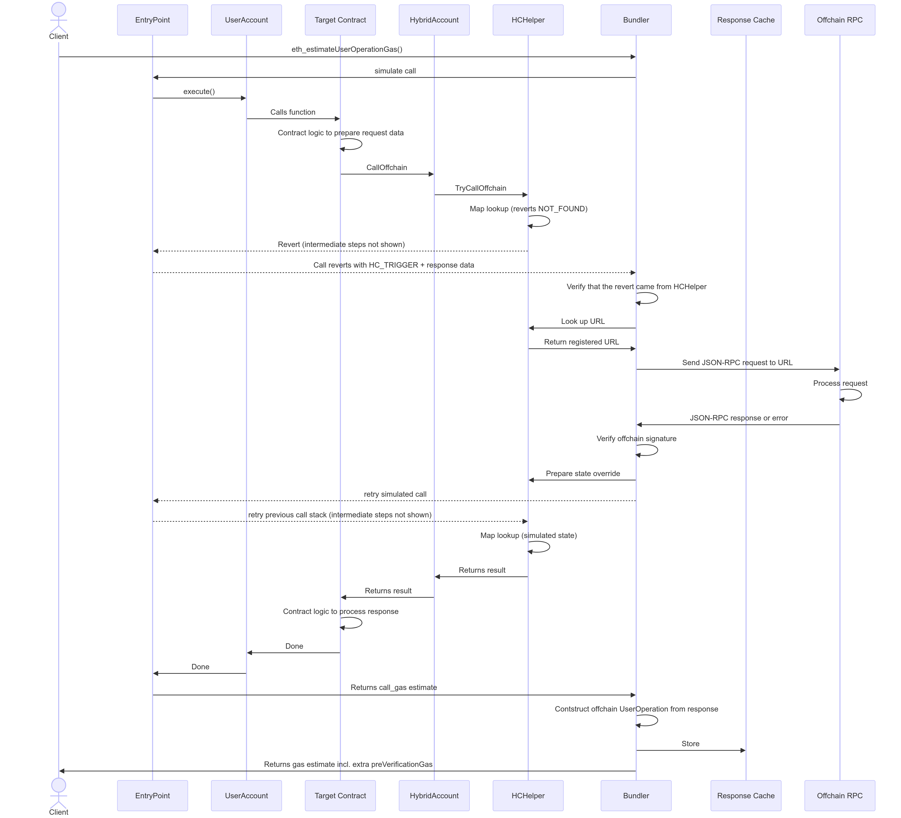
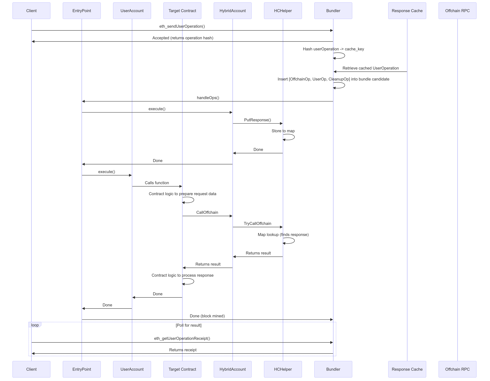

# What is this?
This is a (hopefully) easy to use example of how you can use [Hybrid Compute](https://docs.boba.network/developer/features/aa-basics/hybrid-compute) with [Account Abstraction](https://docs.boba.network/developer/features/aa-basics) to build powerful Web3 Apps!

This "Hello World" example allows you to fetch the current price of any cryptocurrency from an off-chain API such as CoinRanking into your smart contract within 1 single, atomic transaction! 

You can run this repo in 2 ways: 
- On our official testnet "Boba Sepolia"
- or spin up the local stack end-to-end (including the local chain, the bundler for Account Abstraction, the snap, etc.)

# Get started
Clone this repo with `git clone --recurse-submodules -j8 git@github.com:bobanetwork/aa-hc-example.git`

## Installation
You will need a handful of tools to run the full stack (local): 
- `cargo` [[Download]](https://doc.rust-lang.org/cargo/getting-started/installation.html)
- `forge` [[Download]](https://book.getfoundry.sh/getting-started/installation)
- `npm` | `yarn` or `pnpm` [[Download]](https://nodejs.org/en/download/package-manager)
- `golang` [[Download]](https://go.dev/doc/install)
- `Metamask Flask` (Development build of Metamask) [[Download]](https://chromewebstore.google.com/detail/metamask-flask-developmen/ljfoeinjpaedjfecbmggjgodbgkmjkjk)

To run the stack on Boba Sepolia you can skip `cargo` and `golang` which is only required to run the local stack.

## Local
All contracts and services are deployed and environment variables are substituted across all services automatically to ensure a convenient developer experience. 

1. Make sure you have the dependencies as outlined above installed and Docker running.
2. Run `pnpm start:local` to spin the local stack up. Make sure you have [Docker](https://www.docker.com/products/docker-desktop/) running.
3. Head over to [localhost:8001](http://localhost:8001) to create your Smart Wallet.
4. Once you created your account, try it out by using the "Transfer Funds" section. Make sure you funded your new "Snap Account" with some `ETH` on Boba Sepolia.
5. Congrats you sent your first `UserOp` on your local devnet using Account Abstraction! This is the moment your smart account gets deployed on-chain (on the first UserOp).
6. Navigate now to [localhost:8000](http://localhost:8000) to interact with your local DApp which utilizes Hybrid Compute via Account Abstraction to fetch off-chain data to your smart contract! In our example we fetch the current price of a cryptocurrency asset.

Please note, that the local stack actually spins up the Boba L2 locally, the Bundler ("Rundler") along with other local services. This might take a while to startup. 

## Boba Sepolia

1. Copy `/contracts/.env-example` and name it `.env`. All necessary variables are pre-filled except of `PRIVATE_KEY`.
2. Add your own private key, that contains some ETH on Boba Sepolia in order to deploy the contracts on testnet. You can obtain some SepETH on Sepolia (L1) from any [faucet](https://cloud.google.com/application/web3/faucet/ethereum/sepolia) and bridge them to L2 through our [Gateway](https://gateway.boba.network/).
3. Run `pnpm start:sepolia` to spin up the reduced local stack to use the existing infrastructure on Boba Sepolia. 
4. Head over to [hc-wallet.sepolia.boba.network](https://hc-wallet.sepolia.boba.network/) to create your Smart Wallet.
5. Once you created your account, try it out by using the "Transfer Funds" section. Make sure you funded your new "Snap Account" with some `ETH` on Boba Sepolia.
6. Congrats you sent your first `UserOp` on Boba Sepolia using Account Abstraction! If you navigate to the [Block-Explorer](https://testnet.bobascan.com/) you should see your contract wallet.
7. Navigate now to [localhost:8000](http://localhost:8000) to interact with your local DApp which utilizes Hybrid Compute via Account Abstraction to fetch off-chain data to your smart contract! In our example we fetch the current price of a cryptocurrency asset.

When you follow the steps above your application will use the already deployed backend below for simplification. If you want to deploy your own backend instead follow these steps: 
1. Deploy the backend to your cloud of your choosing [[here is more documentation on that](./backend/README.md)]. We've provided you with a [Dockerfile](./backend/Dockerfile) and [Docker Compose](./backend/docker-compose.yml) to make this as easy as possible.
2. Once your backend is live, change the `BACKEND_URL` in your [.env](./contracts/.env) (if the file doesn't exist, you skipped the steps above) within your `contracts folder`. 
3. Rerun the script `pnpm start:sepolia` and try it out as described above.

| Name             | Address                                          | Explainer                           |
|------------------|--------------------------------------------------|-------------------------------------|
| BACKEND          | https://aa-hc-example.onrender.com/hc       |                                     |
| FRONTEND         | https://aa-hc-example-fe.onrender.com     |                                     |
| HC_HELPER_ADDR   | 0x1c64EC0A5E2C58295c3208a63209A2A719dF68D8       | HC Helper is system-wide available  |
| TOKEN_PRICE_ADDR | 0xcad49c0381c1B0779A318c2326Db43A6073adC1e | 
| RPC_URL          | https://gateway.tenderly.co/public/boba-sepolia	 |                                     |
| -> More RPC URls | https://chainlist.org/chain/28882	               |                                     |

This is what a successful transaction will look like: [0x30056b3ff720f4d824422bd077b88c4333e86fbe5522bcdba96cfc8fa2a69b52](https://testnet.bobascan.com/tx/0x30056b3ff720f4d824422bd077b88c4333e86fbe5522bcdba96cfc8fa2a69b52?chainid=28882)

This is what it will look like on the frontend provided:

# How does it work?
This example utilizes [Hybrid Compute 2.0](https://docs.boba.network/developer/features/aa-basics/hybrid-compute) based on [Account Abstraction](https://docs.boba.network/developer/features/aa-basics#what-is-account-abstraction).

Here is a high level overview of what happens:

The actual API call happens when the gas estimation happens (click for full page view):

If the gas estimation was successful, then we can submit our user operation (click for full page view):

# Testing
Whenever you make changes and push to `main` on your Github repository relevant tests are being run by Github actions to make sure everything works as expected.

If you want to run tests locally, execute `pnpm test`.
